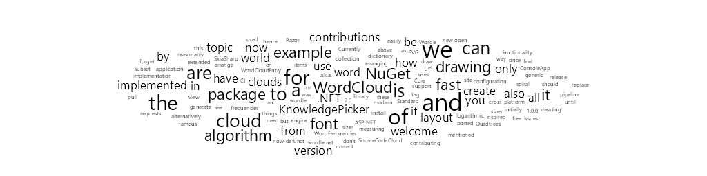

# WordCloud for .NET

[](https://www.nuget.org/packages/KnowledgePicker.WordCloud/)
[](https://github.com/knowledgepicker/word-cloud)

`KnowledgePicker.WordCloud` is a modern (.NET Standard 2.0) and fast library for arranging and drawing [word clouds](https://knowledgepicker.com/t/427/tag-word-cloud) (a.k.a. tag clouds or wordle).



## How to use

1. Install [NuGet package `KnowledgePicker.WordCloud`](https://www.nuget.org/packages/KnowledgePicker.WordCloud/).
2. Get collection of `WordCloudEntry`s. For example if you have dictionary of word frequencies:

   ```cs
   var frequencies = new Dictionary<string, int>();
   // ...collect word frequencies somehow...
   IEnumerable<WordCloudEntry> wordEntries = frequencies.Select(p => new WordCloudEntry(p.Key, p.Value));
   ```

3. Create world cloud configuration:

   ```cs
   var wordCloud = new WordCloudInput(wordEntries)
   {
       Width = 1024,
       Height = 256,
       MinFontSize = 8,
       MaxFontSize = 32
   };
   ```

4. We need to create drawing engine, font sizer and layout. Currently we use [SkiaSharp](https://github.com/mono/SkiaSharp) for fast cross-platform font measuring (and drawing). We also only support logarithmic font sizes and spiral layout. All these things are implemented in a generic way and can be easily extended (contributions are welcome).

   ```cs
   var sizer = new LogSizer(wordCloud);
   using var engine = new SkGraphicEngine(sizer, wordCloud);
   var layout = new SpiralLayout(wordCloud);
   var wcg = new WordCloudGenerator<SKBitmap>(wordCloud, engine, layout);
   ```

5. Now you can *arrange* the topic cloud:

   ```cs
   IEnumerable<(LayoutItem Item, double FontSize)> items = wcg.Arrange();
   ```

   And if we are in a Razor view of an ASP.NET Core application, for example, we can generate SVG from `items`:

   ```cshtml
   <svg viewBox="0,0,@wordCloud.Width,@wordCloud.Height">
   @foreach (var (item, fontSize) in items)
   {
       const string format = "0.##"; // Use at most 2 decimal places.
       var x = (item.Location.X - item.Measured.Left).ToString(format);
       var y = (item.Location.Y - item.Measured.Top).ToString(format);
       var fs = fontSize.ToString(format);
       var delay = (index * 0.03).ToString(format);
       <text transform="translate(@x, @y)" font-size="@fs">@item.Entry.Word</text>
   }
   </svg>
   ```

6. Alternatively, we can *draw* the topic cloud (see also [example `WordFrequencies.ConsoleApp`](examples/WordFrequency.ConsoleApp)):

   ```cs
   using var bitmap = new SKBitmap(wordCloud.Width, wordCloud.Height);
   using var canvas = new SKCanvas(bitmap);

   // Draw on white background.
   canvas.Clear(SKColors.White);
   canvas.DrawBitmap(wcg.Draw(), 0, 0);

   // Save to PNG.
   using var data = final.Encode(SKEncodedImageFormat.Png, 100);
   using var writer = File.Create("output.png");
   data.SaveTo(writer);
   ```

## Algorithm

The world cloud algorithm was initially ported from [SourceCodeCloud](https://archive.codeplex.com/?p=sourcecodecloud). It uses [Quadtrees](https://en.wikipedia.org/wiki/Quadtree), hence it should be reasonably fast. It is inspired by [implementation of Wordle](https://stackoverflow.com/a/1478314) (once famous algorithm used on
now-defunct site [wordle.net](https://web.archive.org/web/20201206102909/http://www.wordle.net/)).

## Contributing

As mentioned [above](#how-to-use), only subset of functionality is implemented now, but all contributions are welcome. Feel free to open [issues](https://github.com/knowledgepicker/word-cloud/issues) and [pull requests](https://github.com/knowledgepicker/word-cloud/pulls).

### Creating NuGet package

Until we have a CI pipeline, this is how we release new version of the package (don't forget to replace 1.0.0 by the correct version):

```bash
cd src/KnowledgePicker.WordCloud
dotnet pack -c Release --include-symbols --include-source -p:PackageVersion=1.0.0
```
